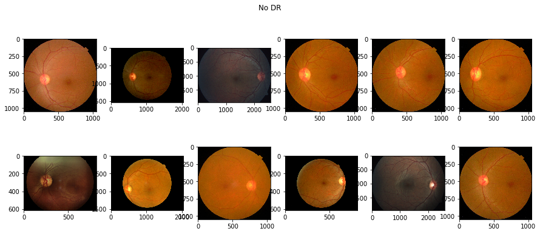

# Blindness Detection

[APTOS 2019 Blindness Detection Challenge](https://www.kaggle.com/c/aptos2019-blindness-detection/overview) of Kaggle

# Dataset

  - Dataset contains 5 categories of retina images
  - The task is to classify images using any **Deep Learning** model
  - Dataset size is ~ **10GB**
  - Dataset download link [https://www.kaggle.com/c/aptos2019-blindness-detection/data](https://www.kaggle.com/c/aptos2019-blindness-detection/data)

# Tools

- **Jupyter Notebook**

# Description
- **VGG16** model is used for image classification
- 5 categories of retina images <br/>
    0 - No DR <br/>
    1 - Mild <br/>
    2 - Moderate <br/>
    3 - Severe <br/>
    4 - Proliferative DR <br/>

 
 
 - Sample retina images
 


- VGG16 Model

```sh
model = Sequential()
model.add(Conv2D(64, (3, 3), activation='relu', input_shape=(image_height, image_width, channel), padding='same'))
model.add(Conv2D(64, (3, 3), activation='relu', padding='same'))
model.add(MaxPooling2D(pool_size=(2, 2)))
model.add(Dropout(0.25))

model.add(Conv2D(128, (3, 3), activation='relu', padding='same'))
model.add(Conv2D(128, (3, 3), activation='relu', padding='same'))
model.add(MaxPooling2D(pool_size=(2, 2)))
model.add(Dropout(0.25))

model.add(Conv2D(256, (3, 3), activation='relu', padding='same'))
model.add(Conv2D(256, (3, 3), activation='relu', padding='same'))
model.add(Conv2D(256, (3, 3), activation='relu', padding='same'))
model.add(MaxPooling2D(pool_size=(2, 2)))
model.add(Dropout(0.25))

model.add(Conv2D(512, (3, 3), activation='relu', padding='same'))
model.add(Conv2D(512, (3, 3), activation='relu', padding='same'))
model.add(Conv2D(512, (3, 3), activation='relu', padding='same'))
model.add(MaxPooling2D(pool_size=(2, 2)))
model.add(Dropout(0.25))

model.add(Conv2D(512, (3, 3), activation='relu', padding='same'))
model.add(Conv2D(512, (3, 3), activation='relu', padding='same'))
model.add(Conv2D(512, (3, 3), activation='relu', padding='same'))
model.add(MaxPooling2D(pool_size=(2, 2)))
model.add(Dropout(0.25))

model.add(Flatten())
model.add(Dense(4096, activation='relu'))
model.add(Dense(4096, activation='relu'))
model.add(Dropout(0.5))
model.add(Dense(num_classes, activation='softmax'))

model.summary()
```
