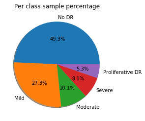

# Blindness Detection

[APTOS 2019 Blindness Detection Challenge](https://www.kaggle.com/c/aptos2019-blindness-detection/overview) of Kaggle

# Dataset

  - Dataset contains 5 categories of retina images
  - The task is to classify images using any **Deep Learning** model
  - Dataset size is ~ **10GB**
  - Dataset download link [https://www.kaggle.com/c/aptos2019-blindness-detection/data](https://www.kaggle.com/c/aptos2019-blindness-detection/data)

# Tools

- **Jupyter Notebook**

# Description
- **VGG16** model is used for image classification
- 5 categories of retina images  
    0 - No DR  
    1 - Mild  
    2 - Moderate  
    3 - Severe  
    4 - Proliferative DR  
 

